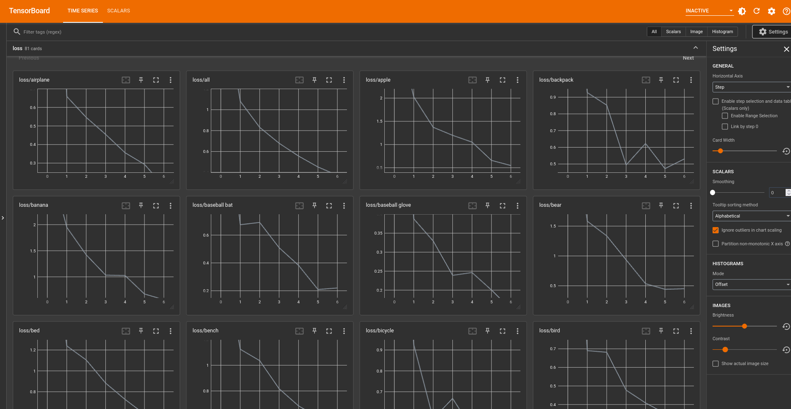

# NOTICE: I'll be updating this repo periodically until I'm happy with it, at which point I'll make a release. Please watch and star to stay up to date.
# TODO
- [x] **Introduce a learnable query bank.** The original Owl-VIT model is multi-modal, taking an image and a prompt as input. Now, the model computes a set of initial queries based on the labels provided which become a parameter of the model. The queries are injected during each forward pass, optimal queries for each class are learned through training. See `experiments/check_text_embeddings_as_priors.ipynb` for more details.
- [x] **Get rid of pycocotools.** It is annoying.
- [ ] **Benchmarks.** Do some benchmarking writeups.
- [ ] **Improve model.** Currently, while the model is functional, it isn't optimal. There seem to be some issues due to the fact that a ton of boxes end up clustered around the object of interest (see `experiments/check_zero_shot_results.ipynb`) that the model is having trouble learning through but this requires more investigation.

# Motivation
Models like CLIP and Owl-VIT are interesting to me because of the massive amount of data that they've been trained on. CLIP's usefulness in the scope of computer vision is limited since it can only handle classification. The ability for Owl-VIT to localize unseen objects extremely well in image-guided one/few shot tasks is impressive, but it still relies on the presence of a query. The idea in this repo is to repurpose Owl-VIT for a traditional object detection task, since its massive pre-training should (hopefully) allow the model to produce good results with much less data than you'd typically need.

# Installation
I recommend using miniconda to handle environments, the setup scipt I've written depends on conda. Setup the environemnt as follows:

```
conda create -n owl python=3.10
conda activate owl
make install
```

After this, your environment should be good to go. Next retrieve the data. Download the coco 2014 train subset from here (images and annotations respectively):
```
http://images.cocodataset.org/zips/train2014.zip
http://images.cocodataset.org/annotations/annotations_trainval2014.zip
```

Unzip them to wherever you want and modify the paths in `config.yaml` to point to the correct locations. **NOTE** I'm only using the train subset to decrease the amount of data I need. Since the goal is to produce a good few-shot model, it's no problem to use a small subset of the train and test on another small subset.

Once you have everything unzipped, run:

```
python scripts/make_coco_subset.py
```

Which will randomly sample the number of instances specified in the yaml until the user accepts the distribution label distribution. It will probably be extremely out of balance but that's okay this is handled during training with scaling.

Now you're ready to train with

```
python main.py
```

During training, for class-level loss plots, run
```
tensorboard --logdir=logs
```

